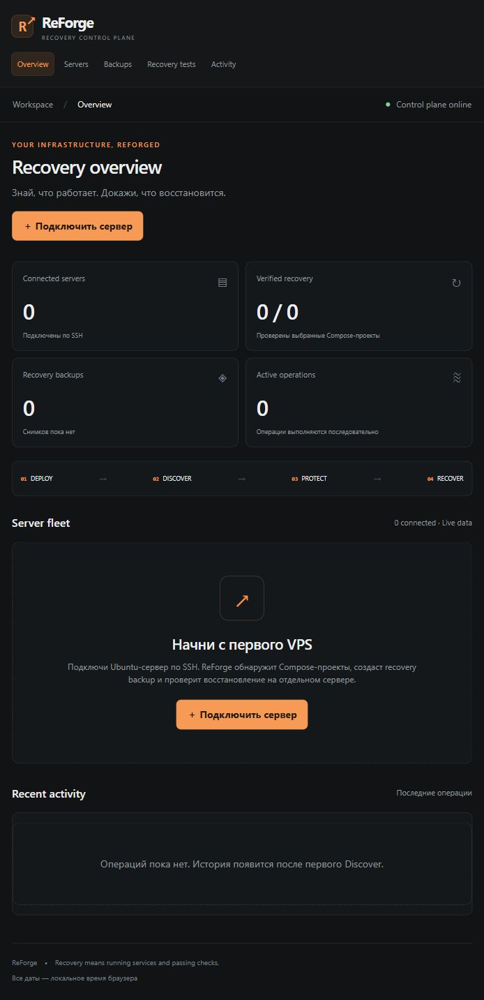

# 🔥 ReForge

**Твоя VPS-инфраструктура — с проверяемым восстановлением.**

ReForge — self-hosted панель управления небольшой VPS-инфраструктурой. Подключи сервер по SSH, изучи его сервисы, создай зашифрованный backup и проверь восстановление на отдельном VPS.

🌐 **Русский** · [English](README.en.md)



## 💡 Главная идея

Сообщение «backup успешно создан» ещё не доказывает, что сервисы можно восстановить.

ReForge сохраняет результаты реального восстановления: какие контейнеры запустились, прошли ли Docker healthcheck и отвечают ли приложения на HTTP-запросы. Каждая проверка привязана к конкретному backup и целевому серверу.

**🚀 DEPLOY → 🔎 DISCOVER → 🛡️ PROTECT → ♻️ RECOVER**

## 🧰 Что реализовано

| Направление | Возможности |
|---|---|
| 🚀 **DEPLOY** | Установка Docker/Compose, SSH-доступ только по ключу, UFW, fail2ban, BBR при поддержке ядра и проверка нового SSH-подключения |
| 🔎 **DISCOVER** | Инвентаризация Ubuntu, Docker/Compose-проектов, контейнеров, named volumes, портов и доменных меток; обнаружение PostgreSQL/MySQL |
| 🛡️ **PROTECT** | Согласованные cold snapshots volumes, файлы проектов и `.env`, дампы БД, фиксация образов по digest и шифрование AES-256-GCM |
| ☁️ **STORAGE** | Локальное хранение, зашифрованные копии в S3/SFTP и загрузка внешней копии при отсутствии локального файла |
| ♻️ **RECOVER** | Проверка отдельного пустого сервера, аутентификация архива, безопасная распаковка, восстановление Compose/volumes и сохранение результатов healthcheck |
| 🎛️ **CONTROL** | Web-панель, API с owner token, история заданий в SQLite, ежедневные backup по выбранному расписанию и Telegram-уведомления |

Проверка охватывает **выбранные Docker Compose-проекты**. Панель показывает фактический статус проверки и измеренное время восстановления. Проценты готовности и прогнозы времени не выдумываются.

## ⚡ Быстрый запуск

На машине ReForge нужны **Node.js 24+** и клиент **OpenSSH**. Дополнительных npm-зависимостей нет.

```sh
git clone https://github.com/BUSH-xanta/ReForge.git
cd ReForge
npm run setup
npm start
```

Открой **http://127.0.0.1:8787** и введи `REFORGE_TOKEN` из созданного `.env`.

Команда setup создаёт независимые ключи для авторизации и шифрования. Существующий `.env` она не перезаписывает.

На удалённых серверах нужны **Python 3** и доступ **root** либо **sudo без пароля**. Автоматическая настройка сейчас поддерживает **Ubuntu 24.04**.

## 🗺️ Первый recovery test

1. 🔑 Проверь SSH fingerprint сервера независимо и добавь его в `known_hosts`.
2. 🔌 Подключи исходный VPS, указав путь к SSH-ключу на машине ReForge.
3. 🔎 Запусти **Discover** и выбери Compose-проекты для backup.
4. 🛡️ Укажи HTTP-healthcheck целевого localhost и подтверди краткую остановку выбранных сервисов для cold snapshot.
5. ♻️ Подключи отдельный пустой Ubuntu VPS с Docker/Compose и запусти **Test Recovery**.
6. ✅ Изучи результаты в **Recovery tests** и журнал в **Activity**.

Восстановленные сервисы остаются на целевом VPS после проверки.

## 🔐 Ключи и данные

- SSH-ключи остаются на машине ReForge; реестр хранит только пути к ним.
- Сохрани `REFORGE_BACKUP_KEY` отдельно: без него архивы не расшифровать.
- Сохраняй реестр SQLite вместе с ключом шифрования отдельно от внешних архивов.
- Полный recovery manifest находится внутри зашифрованного архива и содержит чувствительную Compose-конфигурацию.
- Для удалённого доступа к панели используй SSH-туннель или HTTPS reverse proxy.

## 📦 Текущие границы

Поддерживаются обычные local named volumes и файлы внутри выбранного проекта. Внешние bind mounts, external volumes/networks, anonymous volumes, симлинки, специальные файлы и неопубликованные локальные образы отклоняются.

Host-сервисы, DNS и внешние managed databases не восстанавливаются.

| Ограничение | Значение |
|---|---|
| Локальные / SFTP-архивы | До 20 GiB |
| S3 single-object upload | До 5 GiB |
| Процессы control plane для одного реестра | Один |
| Автоматическое удаление старых backup | Пока не реализовано |
| Создание и удаление VPS для recovery test | Выполняет оператор |

## 🧪 Проверки и статус

```sh
npm test
npm run check
python -m unittest discover -s test -p 'test_*.py'
```

Тесты покрывают авторизацию API, сохранение данных, запрет параллельных операций, расписание, шифрование и повреждение архивов, пример подписи AWS, безопасную распаковку, отказ от восстановления на исходный сервер и перезапуск сервисов после ошибки snapshot. CI также настроен на сборку Docker-образа.

**🚧 Это начальная реализация.** Панель проверена локально. Полный цикл на двух реальных VPS, live S3/SFTP-передача и Telegram-доставка ещё требуют интеграционного прогона с инфраструктурой. Восстановление production пока не доказано.

## 📚 Документация

[Инструкция оператора на английском](docs/operations.md) — настройка, Docker-запуск, хранение, расписание, ограничения и восстановление.
